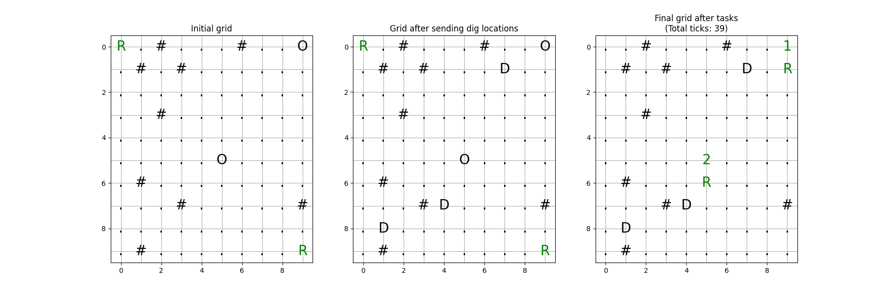
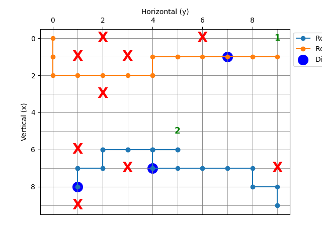

# Multi-Agent Excavation Planning System

This project implements a multi-agent path planning and task assignment algorithm where multiple robots navigate a grid to perform digging tasks and then return to designated drop-off locations to offload their payloads. The algorithm is designed to handle obstacles on the grid and prioritize robots based on a predefined priority level.

## Overview

The system simulates multiple excavation robots that need to perform digging tasks on a grid. The planner computes motion plans for the robots, ensuring efficient task completion while avoiding collisions.

### 1. Initialization and Grid Setup
- The grid is defined with specified dimensions, obstacles, and drop-off locations. Robots are placed at their initial positions on the grid.
- The planner is responsible for managing the robots, including assigning tasks, navigating the grid, and ensuring collision avoidance.

### 2. Task Assignment and Path Planning
- The planner assigns digging tasks to robots based on proximity to the dig locations.
- For each task, the robot calculates the shortest path to the dig location using the A* search algorithm, which is well-suited for grid-based pathfinding.
- After digging, the robot finds the nearest drop-off location and calculates the shortest path to it, again using the A* algorithm.
- If a collision is detected (i.e., a robot's intended position is occupied by another robot with equal or higher priority), the algorithm treats that position as an obstacle and replans the path accordingly.


## Project Structure
```
multi_agent_excavation_planning_system/
├── src/
│   ├── __init__.py          # Makes the src directory a Python package
│   ├── robot.py             # Contains the Robot class
│   ├── point.py             # Contains the Point class
│   ├── planner.py           # Contains the Planner class
├── .github/
│   └── workflows/
│       └── ci.yml           # Continuous Integration configuration file
├── output/                  # Directory for saving output figures
├── main.py                  # Main script for running the project
├── README.md                # Project documentation
├── requirements.txt         # List of dependencies
└── setup.py                 # Setup file for packaging the project
```


## Installation

1. **Clone the Repository**:
   ```bash
   git clone https://github.com/AhmedMAtallah/Multi-Agent-Excavation-Planning
   cd multi_agent_excavation_planning_system
   ```

2. **Install Dependencies**:
   Make sure you have Python 3 installed. Then install the required Python packages using pip:
   \`\`\`bash
   pip install -r requirements.txt
   \`\`\`

## Usage

### Running the Project

To run the project and generate output figures:

```bash
python3 main.py
```

### Output Figures

- The figures generated by the project will be saved in the `output/` directory.
- These figures are the result of running the example scenario described below.

## Example Scenario

In this scenario, a 10x10 grid is used with two robots tasked with digging at specified locations and offloading their loads at drop-off points. The planner calucates their paths to complete tasks efficiently and avoid collisions.

### Resulting Figures

Here are examples of the output figures generated by running the above scenario:

**Grid Before and After Tasks**


This image contains three plots that illustrate the evolution of the 2D grid through different stages of the multi-agent excavation system:

1. **Initial Grid State**: 
   - Shows the grid before any robot operations, including the starting positions of robots (`R`), dig locations (`D`), drop-off locations (`0`), and obstacles (`#`). This represents the initial conditions used by the planner.

2. **Intermediate Grid State (After Sending Dig Locations)**:
   - Depicts the grid after the dig locations have been assigned to the robots. It reflects the positions of robots as they move towards their assigned dig locations and possibly start the excavation process.

3. **Final Grid State (After Job Completion)**:
   - - Shows the grid after the robots have completed their tasks, including digging and offloading at drop-off locations. The final positions of robots, the clearing of dig locations, and updates to drop-off locations are visible in this plot. Notably, the number at each drop-off location represents the total number of loads delivered to that spot by the robots.


**Robot Paths**



 The image displays the actual routes followed by the robots after they have completed their tasks.


## Future Work

1. **Algorithmic Enhancements:**
   **Mixed-Integer Linear Programming (MILP) and Conflict-Based Search (CBS):** Future work will explore MILP amd CPS to optimize multi-agent pathfinding. These algorithms provide robust solutions for collision avoidance and path efficiency. Initial investigations into MILP have already begun, with the aim to integrate more sophisticated optimization techniques into the current system.

 2. **Online Pickup and Delivery Tasks:**
   - I aim to enhance the system to handle online excavating and dropoff tasks, drawing inspiration from the paper ["MAPD: Multi-Agent Pickup and Delivery with Transfers"](https://arxiv.org/abs/1705.10868). This will involve developing algorithms that can 
   dynamically assign and reassign tasks to robots as new requests arrive, optimizing the overall efficiency of the system.

